## Топология сети

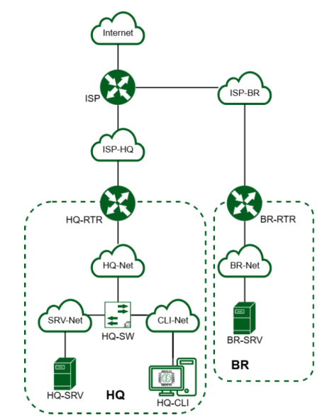
## Содержание 
## Модуль 1. Настройка сетевой инфраструктуры

### Задание 1

Произведите базовую настройку устройств: 
- Настройте имена устройств согласно топологии. Используйте полное доменное имя 
- На всех устройствах необходимо сконфигурировать IPv4: 
	- IP-адрес должен быть из приватного диапазона, в случае, если сеть локальная, согласно RFC1918 
	- Локальная сеть в сторону HQ-SRV(VLAN 100) должна вмещать не более 32 адресов 
	- Локальная сеть в сторону HQ-CLI(VLAN 200) должна вмещать не менее 16 адресов 
	- Локальная сеть для управления(VLAN 999) должна вмещать не более 8 адресов 
	- Локальная сеть в сторону BR-SRV должна вмещать не более 16 адресов
##### Решение:

| Имя устройства | Доменное имя        | IP-адрес                                                        | Шлюз по умолчанию | VLAN          |
| -------------- | ------------------- | --------------------------------------------------------------- | ----------------- | ------------- |
| HQ-RTR         | hq-rtr.au-team.irpo | 172.16.1.2/28; 192.168.0.1/27; 192.168.0.33/28; 192.168.0.49/29 | 172.16.1.1        | 100; 200; 999 |
| BR-RTR         | br-rtr.au-team.irpo | 172.16.2.2/28; 192.168.1.1/28                                   | 172.16.2.1        | Нету          |
| HQ-SRV         | hq-srv.au-team.irpo | 192.168.0.2/27 - сеть 192.168.0.0/27                            | 192.168.0.1       | 100           |
| HQ-CLI         | hq-cli.au-team.irpo | DHCP (192.168.0.35/28) - сеть 192.168.0.32/28                   | 192.168.0.33      | 200           |
| BR-SRV         | br-srv.au-team.irpo | 192.168.1.2/28                                                  | 192.168.1.1       | Нету          |
| ISP            | isp                 | 172.16.1.1/28; 172.16.2.1/28                                    | Не указывает ся   | Нету          |

Доменное имя настраивается командой:

```shell
sudo hostnamectl set-hostname hq-rtr.au-team.irpo; exec bash
```

Настройка ip-адреса производится в файле `/etc/network/interfaces`:

```
#ens33
auto ens33
iface ens33 inet static
address 172.16.1.2
netmask 255.255.255.240
gateway 172.16.1.1
```

Чтобы настройки применились перезагружаем службу `networking`:

```shell
systemctl restart networking
```
### Задание 2

Настройте доступ к сети Интернет, на маршрутизаторе ISP:

- Настройте адресацию на интерфейсах:
- Интерфейс, подключенный к магистральному провайдеру, получает адрес по DHCP
- Настройте маршрут по умолчанию, если это необходимо
- Настройте интерфейс, в сторону HQ-RTR, интерфейс подключен к сети 172.16.1.0/28
- Настройте интерфейс, в сторону BR-RTR, интерфейс подключен к сети 172.16.2.0/28
- На ISP настройте динамическую сетевую трансляцию портов для доступа к сети Интернет HQ-RTR и BR-RTR.
##### Решение:

Пример настройки сетевых интерфейсов на ISP:

```
#ens33
auto ens33
iface ens33 inet dhcp

#ens34
auto ens34
iface ens34 inet static
address 172.16.1.1
netmask 255.255.255.240

#ens35
auto ens36
iface ens36 inet static
address 172.16.2.1
netmask 255.255.255.240
```

Чтобы ВМ могла пропускать через себя траффик необходимо файле `/etc/systcl.p` :

```
net.ipv4.ip_forward=1
```

И применяем изменения:

```shell
sysctl -p
```

NAT настраивается правилом в IPTABLES:

```shell
iptables -t nat -A POSTROUTING -o ens33 -j MASQUERADE
```

Чтобы правила не удалялись скачаем пакет и сохраним правила:

```shell
sudo apt update && sudo apt install -y iptables-persistent 

iptables-save > /etc/iptables/rules.v4
```
### Задание 3

Создайте локальные учетные записи на серверах HQ-SRV и BR-SRV:

- Создайте пользователя remote_user
- Пароль пользователя sshuser с паролем P@ssw0rd
- Идентификатор пользователя 2026
- Пользователь sshuser должен иметь возможность запускать sudo без ввода пароля
- Создайте пользователя net_admin на маршрутизаторах HQ-RTR и BR-RTR
- Пароль пользователя net_admin с паролем P@ssw0rd
- При настройке ОС на базе Linux, запускать sudo без ввода пароля
- При настройке ОС отличных от Linux пользователь должен обладать максимальными привилегиями.
##### Решение:

Создание пользователя `sshuser` происходит командой `useradd`:

```shell
useradd sshuser -m -p $(openssl passwd -6 "P@ssw0rd") -s /bin/bash -u 2026 -G sudo
```

Чтобы данный пользователь мог повышать права без ввода пароля надо отредактировать файл `/etc/sudoers`:

```
%sudo ALL=(ALL) NOPASSWD:ALL
```

Те же самые действия проделываются на RTR-HQ и RTR-BR только для пользователя `net_admin`:

```shell
useradd net_admin -m -p $(openssl passwd -6 "P@ssw0rd") -s /bin/bash -G sudo
```
### Задание 4

Настройте коммутацию в сегменте HQ следующим образом:

- Трафик HQ-SRV должен принадлежать VLAN 100
- Трафик HQ-CLI должен принадлежать VLAN 200
- Предусмотреть возможность передачи трафика управления в VLAN 999
- Реализовать на HQ-RTR маршрутизацию трафика всех указанных VLAN с использованием одного сетевого адаптера ВМ/физического порта
- Сведения о настройке коммутации внесите в отчёт
##### Решение:

Для начала необходимо настроить subinterface на RTR-HQ. Для настройки vlan в Debian первым делом необходимо установить пакет vlan:

```shell
apt update && apt install -y vlan
```

Добавляем модуль ядра для vlan `8021q`. 

```shell
modprobe 8021q

echo "8021q" >> /etc/modules
```

И настраиваем файл `/etc/network/interfaces`:


### Задание 5 

Настройте безопасный удаленный доступ на серверах HQ-SRV и BR-SRV:

- Для подключения используйте порт 2026
- Разрешите подключения исключительно пользователю sshuser
- Ограничьте количество попыток входа до двух
- Настройте баннер «Authorized access only».
##### Решение:

Для начала следует установить `openssh`: 

```shell
apt update && apt install -y openssh-server
```

В файле `/etc/ssh/sshd_config` изменим следующие параметры:

```
port 2026
MaxAuthTries 2
AllowUsers sshuser
Banner /etc/ssh/banner
```

В файле `/etc/ssh/banner` добавляем баннер «Authorized access only»:

```
Authorized access only
```
### Задание 6

Между офисами HQ и BR, на маршрутизаторах HQ-RTR и BR-RTR необходимо сконфигурировать ip туннель:

- На выбор технологии GRE или IP in IP 
- Сведения о туннеле занесите в отчёт.
##### Решение:

Для работы VPN необходимо добавить модули ядра в файле `/etc/modules`:

```
ip_gre
```

И активируем его:

```
modprobe ip_gre
```

В файл `/etc/network/interfaces` добавляем интерфейс:

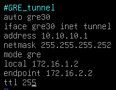

Перезагружаем службу `networking`:

```shell
systemctl restart networking
```
### Задание 7

Обеспечьте динамическую маршрутизацию на маршрутизаторах HQ-RTR и BR-RTR: сети одного офиса должны быть доступны из другого офиса и наоборот. Для обеспечения динамической маршрутизации используйте link state протокол на усмотрение участника:

- Разрешите выбранный протокол только на интерфейсах ip туннеля
- Маршрутизаторы должны делиться маршрутами только друг с другом
- Обеспечьте защиту выбранного протокола посредством парольной защиты
- Сведения о настройке и защите протокола занесите в отчёт
##### Решение

Чтобы настроить динамическую маршрутизацию, скачиваем пакет frr:

```shell
apt update && apt install -y frr
```

Для настройки `ospf` необходимо включить соответствующий демон в конфигурации `/etc/frr/daemons`:

```
ospfd=yes
```

Перезагружаем сервис и добавляем его в автозагрузку:

```shell
systemctl restart frr

systemctl enable --now frr
```

Производим настройку динамическую маршрутизацию на HQ-RTR:

```shell
vtysh

conf t

router ospf

passive-interface default

network 10.10.10.0/30 area 0

network 192.168.0.0/27 area 0

network 192.168.0.32/28 area 0

network 192.168.0.48/29 area 0

area 0 authentication

exit 

interface gre30

no ip ospf network broadcast

no ip ospf passive

ip ospf authentication

ip ospf authentication-key P@ssw0rd

exit

exit

write memory
```

Перезагружаем сервис `frr`:

```shell
systemctl restart frr
```

Производим настройку динамическую маршрутизацию на BR-RTR:

```shell
vtysh

conf t

router ospf

passive-interface default

network 10.10.10.0/30 area 0

network 192.168.1.0/28 area 0

area 0 authentication

exit 
interface gre30

no ip ospf network broadcast

no ip ospf passive

ip ospf authentication

ip ospf authentication-key P@ssw0rd

exit

exit

write memory
```

Перезагружаем сервис `frr`:

```shell
systemctl restart frr
```

Проверяем работу ospf, просмотром соседей:

```shell
show ip ospf neighbor
```

### Задание 8

Настройка динамической трансляции адресов маршрутизаторах HQRTR и BR-RTR:

- Настройте динамическую трансляцию адресов для обоих офисов в сторону ISP, все устройства в офисах должны иметь доступ к сети Интернет
##### Решение

На маршрутизаторах HQ-RTR и BR-RTR прописываем правила в iptables:

```shell
iptables -t nat -A POSTROUTING -o ens33 -j MASQUERADE
```
### Задание 9

Настройте протокол динамической конфигурации хостов для сети в сторону HQ-CLI:

- Настройте нужную подсеть
- В качестве сервера DHCP выступает маршрутизатор HQ-RTR
- Клиентом является машина HQ-CLI
- Исключите из выдачи адрес маршрутизатора
- Адрес шлюза по умолчанию – адрес маршрутизатора HQ-RTR
- Адрес DNS-сервера для машины HQ-CLI – адрес сервера HQ-SRV
- DNS-суффикс – au-team.irpo
- Сведения о настройке протокола занесите в отчёт.
##### Решение

DHCP-сервер поднимается на ISC-DHCP.

```shell
apt update && apt install -y isc-dhcp-server
```

В файле `/etc/dhcp/dhcpd.conf` настраиваем конфигурацию:

```
subnet 192.168.0.32 netmask 255.255.255.240 {
  range 192.168.0.34 192.168.0.46;
  option domain-name-servers 192.168.1.2,192.168.0.2;
  option domain-name "au-team.irpo";
  option routers 192.168.0.33;
  option broadcast-address 192.168.0.47;
  default-lease-time 600;
  max-lease-time 7200;
}
```

В файле `/etc/default/isc-dhcp-server` укажем интерфейс через который будет происходить раздача ip-адресов:

```
INTERFACESv4="ens37.200"
```

Проверяем правильность настройки командой `dhcpd -t -cf /etc/dhcp/dhcpd.conf`.

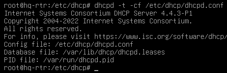

Перезагружаем службу и добавляем ее в автозагрузку:

```shell
systemct restart isc-dhcp-server

systemctl enable --now isc-dhcp-server
```
### Задание 10

Настройте инфраструктуру разрешения доменных имён для офисов HQ и BR:

- Основной DNS-сервер реализован на HQ-SRV
- Сервер должен обеспечивать разрешение имён в сетевые адреса устройств и обратно в соответствии с таблицей 3
- В качестве DNS сервера пересылки используйте любой общедоступный DNS сервер(77.88.8.7, 77.88.8.3 или другие)

Таблица 3:

| Устройство                                    | Запись              | Тип   |
| --------------------------------------------- | ------------------- | ----- |
| HQ-RTR                                        | hq-rtr.au-team.irpo | A,PTR |
| BR-RTR                                        | br-rtr.au-team.irpo | A     |
| HQ-SRV                                        | hq-srv.au-team.irpo | A,PTR |
| HQ-CLI                                        | hq-cli.au-team.irpo | A,PTR |
| BR-SRV                                        | br-srv.au-team.irpo | A     |
| ISP (интерфейс направленный в сторону HQ-RTR) | docker.au-team.irpo | A     |
| ISP (интерфейс направленный в сторону BR-RTR) | web.au-team.irpo    | A     |
##### Решение:

Чтобы настроить bind9, необходимо установить пакеты bind9.

```shell
apt update && apt install -y bind9
```

Приводим файл `/etc/bind/named.conf.options`:

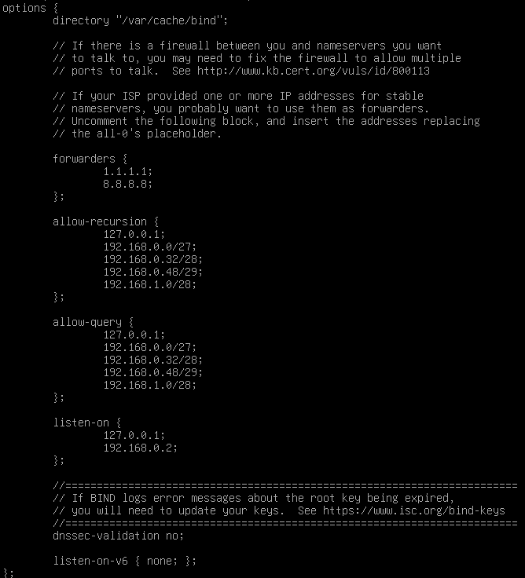

Где указываем публичные серверы DNS для перенаправления запросов, адреса через которые будут приходить DNS-запросы, сети для которых разрешены рекурсивные запросы и сети из которых можем получать запросы.

В файле `/etc/bind/named.conf.local` указываем зоны одну прямую и две обратных.

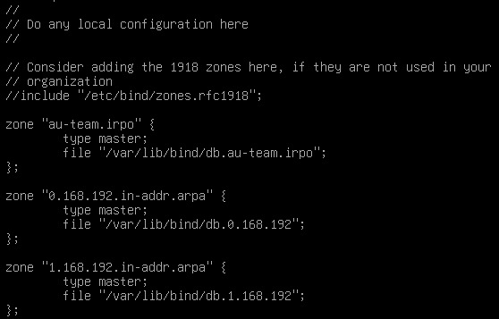

Чтобы было быстрее настроить зоны копируем файлы:

```shell
cp /etc/bind/db.empty /var/lib/bind/db.au-team.irpo

cp /etc/bind/db.empty /var/lib/bind/db.0.168.192

cp /etc/bind/db.empty /var/lib/bind/db.1.168.192
```

Файл `/var/lib/bind/db.au-team.irpo`:

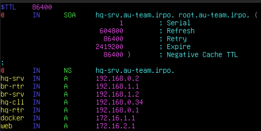

Файл `/var/lib/bind/db.0.168.192`:

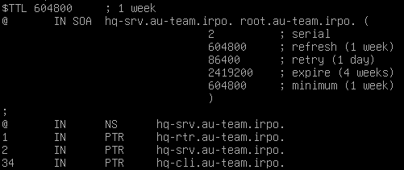

Файл `/var/lib/bind/db.1.168.192`:

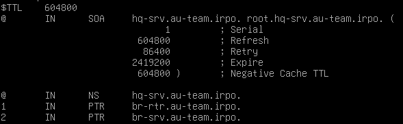

Проверяем наши файлы на ошибки командой `named-checkconf` (если команда ничего не вывела, то все в порядке) для конфигурационных файлов и `named-checkzone` для зон:

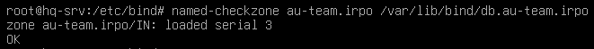

Перезагружаем сервис:

```shell
systemctl restartr bind9
```

Проверяем работу командой `nslookup`:

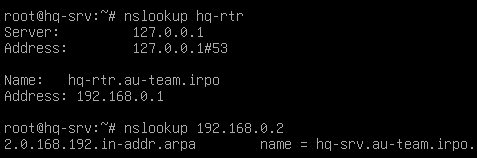
### Задание 11

Настройте часовой пояс на всех устройствах (за исключением виртуального коммутатора, в случае его использования) согласно месту проведения экзамена.
##### Решение 

Установить время можно командой `timedatectl set-timezone Europe/Moscow`.

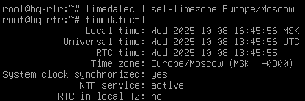
## Модуль 2. Организация сетевого администрирования

### Задание 1

Настройте контроллер домена Samba DC на сервере BR-SRV

- Имя домена au-team.irpo 
- Введите в созданный домен машину HQ-CLI 
- Создайте 5 пользователей для офиса HQ: имена пользователей формата hquser№ (например hquser1, hquser2 и т.д.) 
- Создайте группу hq, введите в группу созданных пользователей 
- Убедитесь, что пользователи группы hq имеют право аутентифицироваться на HQ-CLI 
- Пользователи группы hq должны иметь возможность повышать привилегии для выполнения ограниченного набора команд: cat, grep, id. Запускать другие команды с повышенными привилегиями пользователи группы права не имеют
##### Решение 

В файле `/etc/hosts` для локального сопоставления имени:

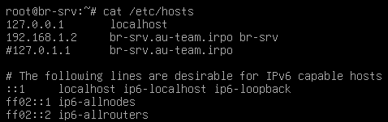

Устанавливаем необходимые пакеты:

```shell
apt update && apt install -y samba winbind libpam-winbind libnss-winbind libpam-krb5 krb5-config krb5-user krb5-kdc 
```

Останавливаем ненужные службы, запрещаем их запуск:

```shell
systemctl stop winbind smbd nmbd krb5-kdc

systemctl mask winbind smbd nmbd krb5-kdc
```

Очищаем базу и конфигурацию Samba:

```shell
rm -f /etc/samba/smb.conf

rm -f /etc/krb5.conf

rm -rf /var/lib/samba

rm -rf /var/cache/samba

mkdir -p /var/lib/samba/sysvol
```

Для интерактивного развертывания запускаем `samba-tool domain provision`:

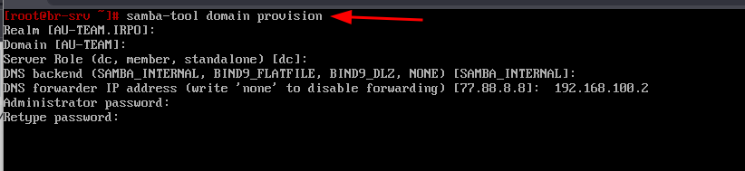

Где:

- У Samba свой собственный DNS-сервер. В DNS forwarder IP address нужно указать внешний DNS-сервер, чтобы DC мог разрешать внешние доменные имена
- При запросе ввода нажимайте Enter за исключением запроса пароля администратора («Administrator password:» и «Retype password:»)
- Пароль администратора должен быть не менее 7 символов и содержать символы как минимум трёх групп из четырёх возможных: латинских букв в верхнем и нижнем регистрах, чисел и других небуквенно-цифровых символов
- Пароль, не полностью соответствующий требованиям, это одна из причин завершения развертывания домена ошибкой
- При правильной базовой настройки устройства, все параметры подставятся автоматически

Включаем в автозагрузку службу samba:

```shell
systemctl enable --now samba-ad-dc
```

Копируем образец файла с настройкой Kerberos:

```shell
cp /var/lib/samba/private/krb5.conf /etc/krb5.conf
```

Перезагружаем службу `samba-ad-dc`:

```shell
systemct restart samba-ad-dc
```

Теперь настроим NTP-сервер, чтобы не возникало ситуации, когда разница между клиентом и контроллером домена была более 5 минут, из-за чего не будет происходить аутентификация. Устанавливаем пакет chrony:

```shell
apt update && apt install -y chrony
```

В файле `/etc/chrony/chrony.conf` вносим данные изменения:

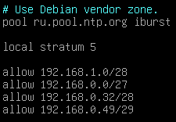

После этого перезагружаем ее и добавляем в автозагрузку:

```shell
systemctl restart chronyd

systemctl enable --now chronyd
```

Получаем Kerberous билет командой `kinit administrator` и смотрим выданные билеты командой `klist`:

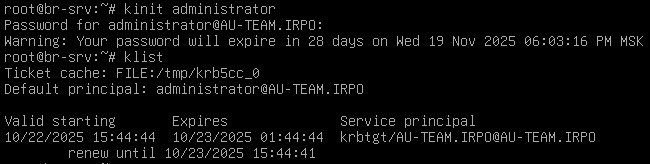

Создаем группу hq:

```shell
samba-tool group add hq
```

Посмотреть группы можно командой:

```shell
samba-tool group list
```

Напишем скрипт для создания пользователей, чтобы не повторять одно действие по многу раз. Сначала перейдем домашнюю директорию пользователя командой `cd`, создадим в ней файл create_domain_user.sh командой `touch create_domain_user.sh`. Откроем файл `create_domain_user.sh` с помощью nano и прописываем в нем следующие:

```shell
#/bin/bash 

for i in {1..5}; do
	samba-tool user add hquser$i P@ssw0rd;
	samba-tool user setexpiry hquser$i --noexpiry;
	samba-tool group addmembers "hq" hquser$i;
done
```

Добавляем файлу `create_domain_user.sh` бит исполнения командой `chmod +x create_domain_user.sh` и запускаем его вводя в терминал `./create_domain_user.sh`.

Просмотр пользователей домена выполняется командой:

```shell
samba-tool user list
```

Из-за того, что SAMBA_INTERNAL не может перенаправлять запросы, создадим DNS записи на контроллере домена:

```sh
samba-tool dns add 127.0.0.1 au-team.irpo br-rtr 192.168.1.1 -U administrator

samba-tool dns add 127.0.0.1 au-team.irpo hq-rtr 192.168.0.1 -U administrator

samba-tool dns add 127.0.0.1 au-team.irpo docker 172.16.1.1 -U administrator

samba-tool dns add 127.0.0.1 au-team.irpo web 172.16.2.1 -U administrator

samba-tool dns add 127.0.0.1 au-team.irpo hq-cli 192.168.0.34 -U administrator

samba-tool dns add 127.0.0.1 au-team.irpo hq-srv 192.168.0.2 -U administrator
```

Теперь переходим к клиенту, для начала настраиваем синхронизацию времени с контроллером домена редактируем файл `/etc/systemd/timesyncd.conf`, где указываем значение в строчке `NTP=`:

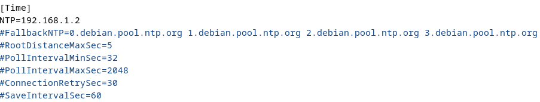

После этого перезагружаем службу и добавляем в автозагрузку командой:

```shell
systemctl restart systemd-timesyncd

systemctl enable --now systemd-timesyncd
```

Проверить время на ВМ можно командой:

```shell
timedatectl
```

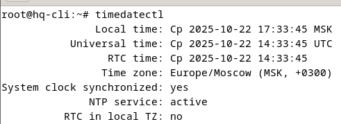

Для ввода рабочей станции установим на нее следующие пакеты:

```shell
apt update && apt install -y realmd sssd-tools sssd libnss-sss libpam-sss adcli samba-common-bin oddjob oddjob-mkhomedir packagekit -y
```

Выполнение обнаружение домена должно обработать без ошибок:

```shell
realm discover au-team.irpo --verbose
```

Чтобы директория доменного пользователя автоматически создавалась изменим файл `/usr/share/pam-configs/mkhomedir`:

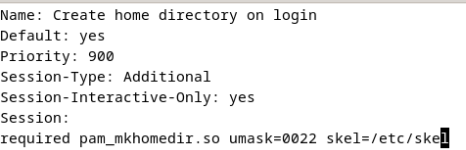

Введем команду:

```shell
pam-auth-update
```

И ставим `*` напротив **Create home directory on login**:

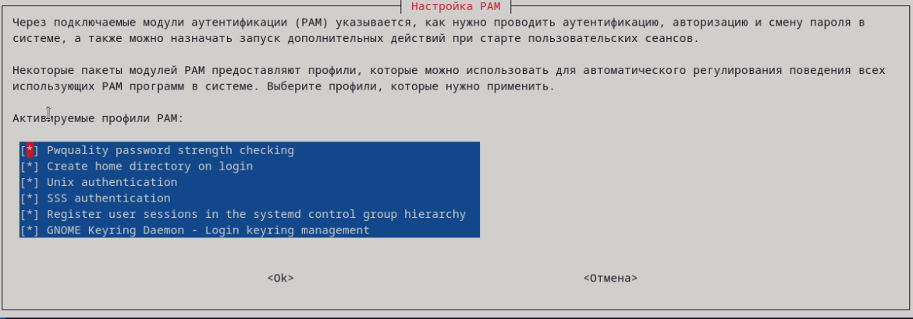

Разрешаем вход на рабочую станцию всем пользователям:

```shell
realm permit --all
```

Присоединим РС к домену:

```shell
realm join AU-TEAM.IRPO
```

Чтобы пользователи могли повышать права для команд `cat, grep, id` необходимо на клиенте зайти под локальным пользователем и создадим файл в директории `/etc/sudoers.d/hq-group-command` с содержанием:

```
%hq@au-team.irpo     ALL=(ALL:ALL) /usr/bin/grep, /usr/bin/id, /usr/bin/cat
```
### Задание 2

Сконфигурируйте файловое хранилище на сервере HQ-SRV: 

- При помощи двух подключенных к серверу дополнительных дисков размером 1 Гб сконфигурируйте дисковый массив уровня 0 
- Имя устройства – md0, при необходимости конфигурация массива размещается в файле /etc/mdadm.conf 
- Создайте раздел, отформатируйте раздел, в качестве файловой системы используйте ext4 • Обеспечьте автоматическое монтирование в папку /raid
##### Решение:

В гипервизоре добавим два накопителя размером 1 Гб:


Для настройки аппаратного RAID-массива используется пакет mdadm, поэтому следует ее установить:

```shell
apt update && apt install -y mdadm
```

Посмотреть размер накопителей можно командой:

```shell
lsblk
```

Два диска размер, которых равен 1 Gb, мы и будем работать.

Подготавливаем диски к включению в RAID-массив. Сначала очищаем суперблоки дисков `sda` и `sdc` (название дисков, может отличаться):

```shell
mdadm --zero-superblock --force /dev/sd{a,c}
```

Удаляем метаданные и подпись на дисках:

```shell
wipefs --all --force /dev/sd{a,c}
```

Для сборки RAID массива уровня 0 (объемы дисков складываются и увеличивается скорость), используем команду:

```shell
mdadm --create --verbose /dev/md0 --level=0 --raid-devices=2 /dev/sda /dev/sdc
```

Проверим, что диск вошли в состав массива:

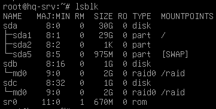

Для правильной работы `mdadm` необходимо создать конфигурационный файл конфигурации `mdamd.conf`, для чего выполним следующую команду:

```shell
mdadm --detail --scan | tee -a /etc/mdamd/mdamd.conf
```

Создадим файловую систему на устройстве `/dev/md0`:

```shell
mkfs.ext4 /dev/md0 
```

Далее создадим директорию куда будем монтировать устройство `/dev/md0`:

```shell
mkdir -p /raid
```

Чтобы устройство автоматически монтировалось в директорию `/raid` внесем устройство в файл `/etc/fstab`. Но до этого необходимо узнать его UUID командой:

```shell
blkid | grep md0
```

Чтобы не писать самому длинный номер UUID можно перенаправить вывод команды `blkid | grep md0 ` в файл `/etc/fstab`:

```shell
blkid | grep md0 >> /etc/fstab
```

Далее приводим файл `/etc/fstab` к данному виду:

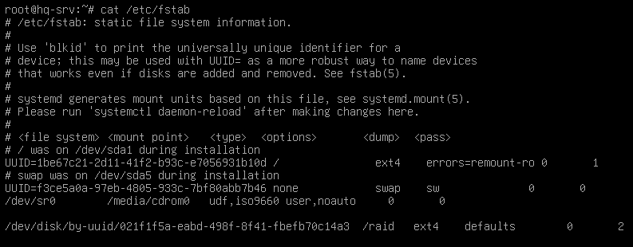

Для того, чтобы ОС знала о массиве на раннем этапе загрузки, нужно обновить информацию для `initramfs`, выполним команду:

```shell
update-initramfs -u
```

Примонтировать `/dev/md0` можно в `/raid` командой:

```shell
mount -a
```

### Задание 3

Настройте сервер сетевой файловой системы (nfs) на HQ-SRV:

- В качестве папки общего доступа выберите /raid/nfs, доступ для чтения и записи исключительно для сети в сторону HQ-CLI
- На HQ-CLI настройте автомонтирование в папку /mnt/nfs
- Основные параметры сервера отметьте в отчёте
##### Решение:

Чтобы настроить NFS-хранилище используется пакет `nfs-kernel-server`:

```shell
apt update && apt install -y nfs-kernel-server 
```

Создадим директорию `/raid/nfs`:

```shell
mkdir -p /raid/nfs
```

Изменим права доступа:

```shell
chmod 777 /raid/nfs
```

В файл `/etc/exports`, внесем следующие изменения:

```shell
/raid/nfs    192.168.0.32/28(rw,no_root_squash,no_subtree_check)
```

Где:

- `/raid/nfs` - локальная папка, которая станет сетевой
- `192.168.0.32/28` - подсеть устройств из которой разрешаем подключаться
- `rw` - разрешаем запись и чтение 
- `no_root_squash` - все подключения выполняются от не анонимной УЗ
- `no_subtree_check` - если экспортируется подкаталог, то система будет проверять находится ли запрошенный файл в экспортированном подкаталоге, отключение проверки несколько снижает безопасность, но увеличивает производительность

Чтобы применить изменения используем команду:

```shell
exportfs -ra
```

Теперь переходим к клиенту и устанавливаем пакет `nfs-common`:

```shell
apt update && apt install -y nfs-common
```

Создаем директорию `/mnt/nfs` и изменяем права доступа:

```shell
mkdir -p /mnt/nfs

chmod 777 /mnt/nfs
```

Вносим изменения в `/etc/fstab`:


После перезагружаем все демоны и монтируем все директории из `/etc/fstab`:

```shell
systemct daemon-reload

mount -a
```

Для тестирования на hq-srv создадим файл `test.txt` и посмотрим появился он на hq-cli в директории `/mnt/nfs`.
### Задание 4

Настройте службу сетевого времени на базе сервиса chrony на маршрутизаторе ISP:

- Вышестоящий сервер ntp на маршрутизаторе ISP - на выбор участника
- Стратум сервера - 5
- В качестве клиентов ntp настройте: HQ-SRV, HQ-CLI, BR-RTR, BR-SRV
##### Решение 

Для начала установим пакет chrony для создания NTP-сервера:

```shell
apt update && apt install -y chrony
```

В файле `/etc/chrony/chrony.conf` вносим данные изменения:


На клиентах HQ-SRV, HQ-CLI, BR-RTR, BR-SRV в файле `/etc/systemd/timesyncd.conf` укажем ip-адрес NTP-сервера:

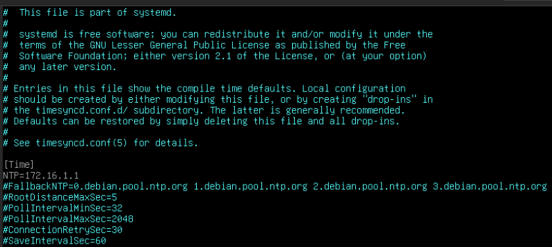

После этого перезагрузим службу `systemd-timesyncd`:

```shell
systemctl restart systemd-timesyncd
```
### Задание 5

Сконфигурируйте ansible на сервере BR-SRV: 

- Сформируйте файл инвентаря, в инвентарь должны входить HQ-SRV, HQ-CLI, HQ-RTR и BR-RTR 
- Рабочий каталог ansible должен располагаться в /etc/ansible 
- Все указанные машины должны без предупреждений и ошибок отвечать pong на команду ping в ansible посланную с BR-SRV.
##### Решение:

Установить ansible на debian 12 можно воспользоваться командами:

```shell
apt update && apt install -y pipx

pipx ensurepath

pipx install --include-deps ansible

source ~/.bashrc

source ~/.profile
```

После этого создадим рабочую директорию ansible:

```shell
mkdir /etc/ansible
```

Так как ansible производит подключение по ssh, то нам придется для этого сгенерировать открытый и закрытый ключ для подключения:

Генерирование ключей:

```shell
ssh-keygen
```

Распространение ключей на HQ-SRV:

```shell
ssh-copy-id -p 2026 sshuser@192.168.0.2
```

Распространение ключей на HQ-RTR, BR-RTR и HQ-CLI:

```shell
ssh-copy-id root@192.168.0.34

ssh-copy-id root@192.168.0.1

ssh-copy-id root@192.168.1.1
```

В файле `/etc/ansible/ansbile.cfg` прописываем переменные окружения, где `host_key_checking` отменяет проверку ключа, а `inventory` задает путь к inventory файлу:

```
[defaults]
host_key_checking = false
inventory = ./hosts
private_key_file = /root/.ssh/id_rsa
```

В файле `/etc/ansible/hosts` определяем хосты к которым ansible должен подключиться:

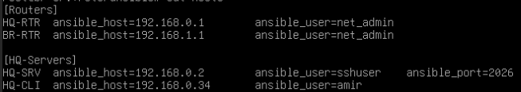

Проверяем, что связь с удаленными хостами установлена:

```shell
ansible all -m ping
```
### Задание 6

Разверните веб приложение в docker на сервере BR-SRV: 

- Средствами docker должен создаваться стек контейнеров с веб приложением и базой данных 
- Используйте образы site_latest и mariadb_latest располагающиеся в директории docker в образе Additional.iso 
- Основной контейнер testapp должен называться tespapp 
- Контейнер с базой данных должен называться db 
- Импортируйте образы в docker, укажите в yaml файле параметры подключения к СУБД, имя БД - testdb, пользователь testс паролем P@ssw0rd, порт приложения 8080, при необходимости другие параметры • Приложение должно быть доступно для внешних подключений через порт 8080
##### Решение:

ISO-образ Additional.iso можно скачать по ссылке https://disk.yandex.ru/d/0MGlkrp2B9nXDw. После того как произошло скачивание добавляем ISO-образ к виртуальной машине. Заходим в настройки ВМ и выбираем добавить CD/DVD диск.

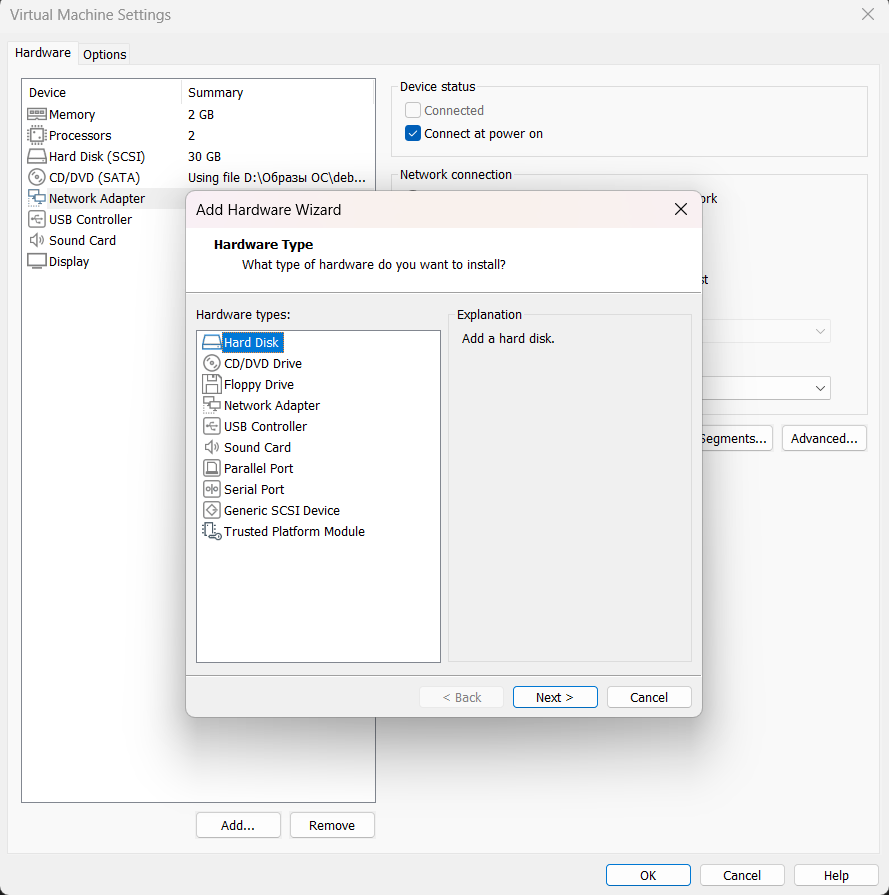

После выбираем наш файл Additional.iso.

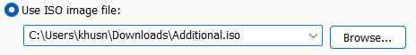

После этого командой `lsblk` можно увидеть, что диск добавлен:

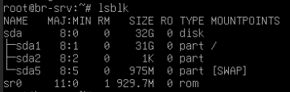

Установить docker можно с помощью уже готового скрипта, который есть на сайте разработчика:

```shell
 curl -fsSL https://get.docker.com -o get-docker.sh
 
 sh get-docker.sh
 
 apt update && apt install -y docker-ce
```

Теперь предстоит примонтировать iso образ и извлечь необходимые файлы:

```shell
mount /dev/sr0 /mnt
```

После этого импортируем docker образы:

```shell
docker load < /mnt/docker/site_latest.tar

docker load < /mnt/docker/mariadb_latest.tar
```

Проверим, что образы добавились:

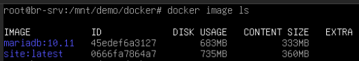

Также у данного веб-приложения есть инструкция:

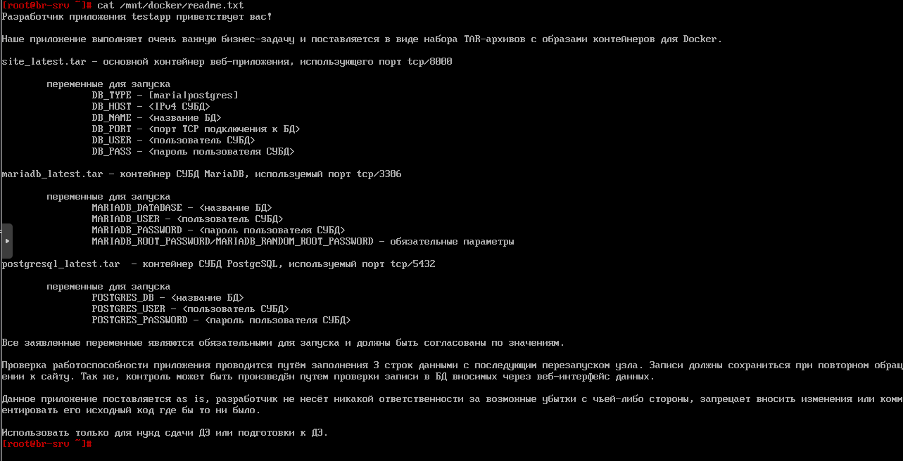

Создадим docker-compose файл:

```yaml
services:
    database:
	  container_name: db
      image: mariadb:10.11
      restart: unless-stopped
      ports:
        - 3306:3306
	  environment:
	    MARIADB_DATABASE: "testdb"
	    MARIADB_USER: "testc"
	    MARIADB_PASSWORD: "P@ssw0rd"
	    MARIADB_ROOT_PASSWORD: "P@ssw0rd"
	    
	app:
	  container_name: app
	  image: site:latest
	  restart: unless-stopped
	  ports:
	    - 8080:8000
	  environment:
	    DB_TYPE: "maria"
	    DB_HOST: "192.168.1.2"
	    DB_NAME: "testdb"
	    DB_PORT: "3306"
	    DB_USER: "testc"
	    DB_PASS: "P@ssw0rd"
	  depends_on:
	    - database
```

Запускаем compose файл:

```shell
docker compose up -d
```

Смотрим, что контейнеры запустились:

```shell
docker ps
```

И переходим в браузере по адресу http://192.168.1.2:8080:

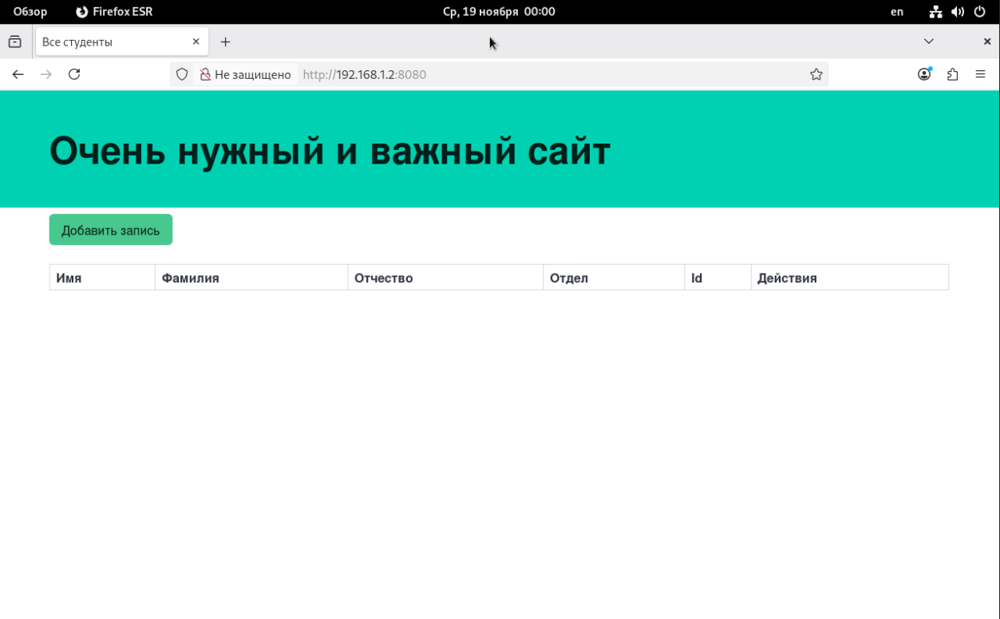
### Задание 7

Разверните веб приложение на сервере HQ-SRV: 

- Используйте веб-сервер apache 
- В качестве системы управления базами данных используйте mariadb 
- Файлы веб приложения и дамп базы данных находятся в директории web образа Additional.iso 
- Выполните импорт схемы и данных из файла dump.sql в базу данных webdb
- Создайте пользователя webс паролем P@ssw0rd и предоставьте ему права доступа к этой базе данных 
- Файлы index.php и директорию images скопируйте в каталог веб сервера apache 
- В файле index.php укажите правильные учётные данные для подключения к БД 
- Запустите веб сервер и убедитесь в работоспособности приложения 
- Основные параметры отметьте в отчёте
##### Решение:

ISO-образ Additional.iso можно скачать по ссылке https://disk.yandex.ru/d/0MGlkrp2B9nXDw. После того как произошло скачивание добавляем ISO-образ к виртуальной машине. Заходим в настройки ВМ и выбираем добавить CD/DVD диск.


После выбираем наш файл Additional.iso.


После этого командой `lsblk` можно увидеть, что диск добавлен:


Теперь примонтируем внешний накопитель:

```shell
mount /dev/sr0 /mnt
```

Для выполнения данного задания нам понадобится установить LAMP-стек (Linux, Apache, MySQL, PHP). 

Установка apache2:

```shell
apt update && apt install apache2
```

Установка mariadb:

```shell
apt update && apt install mariadb-server -y
```

Установка PHP:

```shell
apt update && apt install -y php libapache2-mod-php php-mysql php-mariadb-mysql-kbs
```

После установки компонентов перенесем файлы с внешнего накопителя:

```shell
rm /var/www/html/index.html

cp /mnt/web/logo.png /var/www/html/

cp /mnt/web/index.php /var/www/html/

chmod 644 /var/www/html/index.php
```

В файле `/var/www/html/index.php` укажем параметры для подключения к БД:

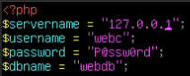

Теперь переходим к СУБД MySQL, для начала подготовим ее:

```shell
mysql_secure_installation
```

Где:

- на первом шаге нас спросят хотим ли мы включить валидацию пароля, ставим N
- на втором шаге есть возможность изменить пароль от пользователя root (здесь по вашему усмотрению)
- во всех следующих вопросах нужно отвечать утвердительно путем ввода y/Y или Yes:
	- запретить удалённый вход для пользователя root
	- запретить гостевой вход
	- удалить временные таблицы
	- обновить привилегии пользователей

Входим в оболочку Mariadb:

```shell
mariadb -u root
```

Создаем БД с именем `webdb`:

```shell
CREATE DATABASE webdb;
```

Создаем пользователя `webc` с паролем `P@ssw0rd`:

```shell
CREATE USER ‘webc’@’localhost’ IDENTIFIED BY ‘P@ssw0rd’;
```

Выдаем пользователю `webc` полные права для БД `webdb`:

```shell
GRANT ALL PRIVILEGES ON webdb.* TO ‘webc’@’localhost’ WITH GRANT OPTION;
```

Выходим из оболочки:

```shell
exit
```

Выполняем импорт схемы в БД `webdb`:

```shell
mariadb -u webc -p -D webdb < /mnt/web/dump.sql
```

Проверяем:

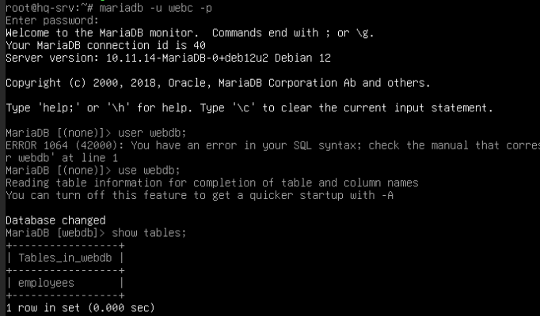

Теперь включаем сервисы:

```shell
systemctl restart apache2

systemctl enable --now apache2

systemctl enable --now mariadb
```

Проверка, что сайт запустился.


### Задание 8

На маршрутизаторах сконфигурируйте статическую трансляцию портов:

- Пробросьте порт 8080 в порт приложения testapp BR-SRV на маршрутизаторе BR-RTR, для обеспечения работы приложения testapp извне
- Пробросьте порт 8080 в порт веб приложения на HQ-SRV на маршрутизаторе HQ-RTR, для обеспечения работы веб приложения извне
- Пробросьте порт 2026 на маршрутизаторе HQ-RTR в порт 2026 сервера HQ-SRV, для подключения к серверу по протоколу ssh из внешних сетей
- Пробросьте порт 2026 на маршрутизаторе BR-RTR в порт 2026 сервера BR-SRV, для подключения к серверу по протоколу ssh из внешних сетей
##### Решение:

Для проброса портов нам понадобится хорошо уже известный файервол `iptables`.

Правило проброса портов с внутреннего 8080 на внешний 8080 для сервера BR-SRV:

```shell
iptables -A FORWARD -i ens18 -o ens19 -j ACCEPT

iptables -t nat -A PREROUTING -p tcp -d 172.16.2.2 --dport 8080 -j DNAT --to-destination 192.168.1.2:8080

iptables -t nat -A POSTROUTING -p tcp --sport 8080 --dst 192.168.1.2 -j SNAT --to-source 172.16.2.2:8080

iptables-save > /etc/iptables/rules.v4
```

Правило проброса портов с внутреннего 80 на внешний 8080 для сервера HQ-SRV:

```shell
iptables -A FORWARD -i ens18 -o ens19 -j ACCEPT

iptables -t nat -A PREROUTING -p tcp -d 172.16.1.2 --dport 8080 -j DNAT --to-destination 192.168.0.2:80

iptables -t nat -A POSTROUTING -p tcp --sport 80 --dst 192.168.0.2 -j SNAT --to-source 172.16.1.2:8080

iptables-save > /etc/iptables/rules.v4
```

Правило проброса портов с внутреннего 2026 на внешний 2026 для сервера BR-SRV:

```shell
iptables -t nat -A PREROUTING -p tcp -d 172.16.2.2 --dport 2026 -j DNAT --to-destination 192.168.1.2:2026

iptables -t nat -A POSTROUTING -p tcp --sport 2026 --dst 192.168.1.2 -j SNAT --to-source 172.16.2.2:2026

iptables-save > /etc/iptables/rules.v4
```

Правило проброса портов с внутреннего 2026 на внешний 2026 для сервера HQ-SRV:

```shell
iptables -t nat -A PREROUTING -p tcp -d 172.16.1.2 --dport 2026 -j DNAT --to-destination 192.168.0.2:2026

iptables -t nat -A POSTROUTING -p tcp --sport 2026 --dst 192.168.0.2 -j SNAT --to-source 172.16.1.2:2026

iptables-save > /etc/iptables/rules.v4
```
### Задание 9

Настройте веб-сервер nginx как обратный прокси-сервер на ISP:

- При обращении по доменному имени web.au-team.irpo у клиента должно открываться веб приложение на HQ-SRV
- При обращении по доменному имени docker.au-team.irpo клиента должно открываться веб приложение testapp (BR-SRV)
##### Решение:

Для начала нам надо установить веб-сервер nginx на виртуальную машину ISP:

```shell
apt update && apt install -y nginx
```

После этого запускаем веб-сервер:

```shell
systemctl start nginx

systemctl enable --now nginx
```

Создаем файл `/etc/nginx/sites-available/docker.au-team.irpo` со следующим содержимым:

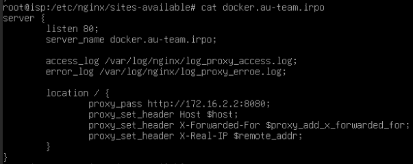

Создаем файл `/etc/nginx/sites-available/web.au-team.irpo` со следующим содержимым:

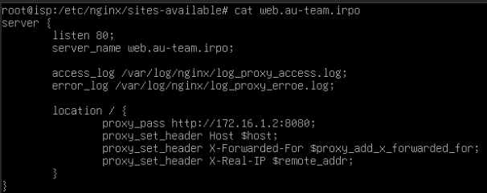

Далее создаем символьные ссылки ранее созданных файлов в директорию `/etc/nginx/sites-enabled`:

```shell
ln -s /etc/nginx/sites-available/web.au-team.irpo /etc/nginx/sites-enabled/

ln -s /etc/nginx/sites-available/docker.au-team.irpo /etc/nginx/sites-enabled/
```

После этого проверяем конфигурацию командой:

```shell
nginx -t 
```

Перезагружаем nginx:

```shell
nginx -s reload
```

Проверяем работу, сайт должен открыться по доменному имени:

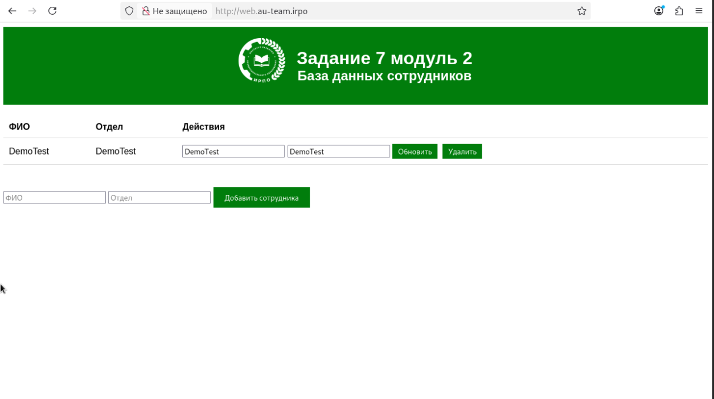
### Задание 10

На маршрутизаторе ISP настройте web-based аутентификацию:

- При обращении к сайту web.au-team.irpo клиенту должно быть предложено ввести аутентификационные данные
- В качестве логина для аутентификации выберите WEB с паролем P@ssw0rd
- Выберите файл /etc/nginx/.htpasswd в качестве хранилища учётных записей
- При успешной аутентификации клиент должен перейти на веб сайт
##### Решение:

Установим пакет для создания файла паролей:

```shell
apt update && apt install -y apache2-utils
```

Средствами утилиты htpasswd создать пользователя WEB и добавить информацию о нём в файл `/etc/nginx/.htpasswd`, задав пароль P@ssw0rd:

```shell
htpasswd -c /etc/nginx/.htpasswd WEB
```

Добавим web-based аутентификацию для доступа к сайту web.au-team.irpo в конфигурационный файл `/etc/nginx/sites-available/web.au-team.irpo:

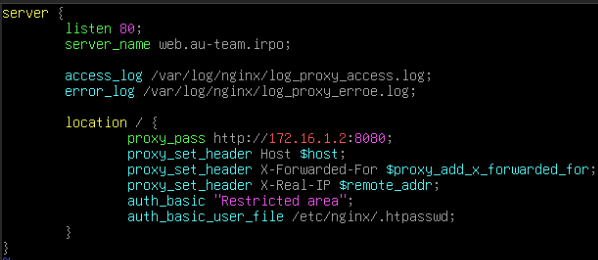

После этого проверяем конфигурацию и перезагружаем `nginx`:

```shell
nginx -t

nginx -s reload
```

Откроем сайт web.au-team.irpo с клиента:

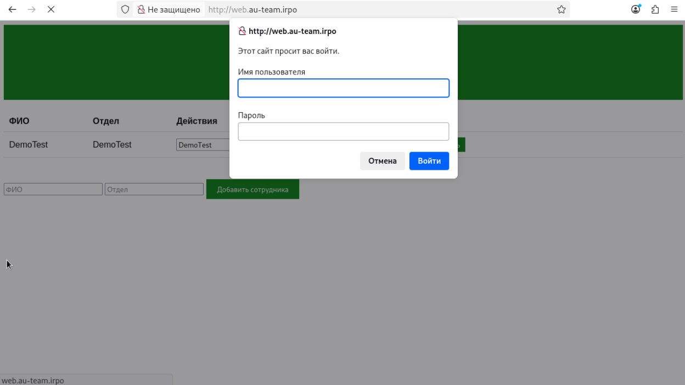
### Задание 11

Удобным способом установите приложение Яндекс Браузер на HQ-CLI • Установку браузера отметьте в отчёте.
##### Решение:

Команды для установки яндекс браузера:

```shell
add-apt-repository "deb https://repo.yandex.ru/yandex-browser/deb stable main"

curl https://repo.yandex.ru/yandex-browser/YANDEX-BROWSER-KEY.GPG --output YANDEX-BROWSER-KEY.GPG

apt-key add YANDEX-BROWSER-KEY.GPG

apt update && apt install yandex-browser-corporate -y
```
## Модуль 3. Эксплуатация объектов сетевой инфраструктуры
### Задание 1

Эксплуатация объектов сетевой инфраструктуры:

- В качестве файла источника выберите файл users.csv располагающийся в образе Additional.iso
- Пользователи должны быть импортированы со своими паролями и другими атрибутами
- Убедитесь, что импортированные пользователи могут войти на машину HQ-CLI
##### Решение

По заданию пользователи хранятся в файле `Users.csv`.

Используемые атрибуты находятся в первой строчке файла `Users.csv`:

```shell
head -n1 /mnt/Users.csv
```

Узнаем какие организационные подразделения находятся в этом файле:

```shell
awk -F ';' 'NR>1 {print $5}' /mnt/Users.csv | uniq
```

Далее напишем скрипт `import_user.sh` по импорту пользователей:

```shell
#!/bin/bash

csv_file="$1"

awk -F ';' 'NR>1 {print $5}' "$csv_file" | uniq | while read ou; do
    samba-tool ou add OU="$ou",DC=au-team,DC=irpo;
done

while IFS=";" read -r firstName lastName role phone ou street zip city country password; do
    if [ "$firstName" == "First Name" ]; then
        continue
    fi

    username="${firstName,,}.${lastName,,}"

    samba-tool user add "$username" P@ssw0rd1 \
        --given-name="$firstName" \
        --surname="$lastName" \
        --telephone-number="$phone" \
        --job-title="$role" \
        --userou="OU=$ou"
    samba-tool user setexpiry "$username" --noexpiry
    samba-too user enable "$username"
done < "$csv_file"
```

Добавляем к файлу со скриптом бит исполнения и применяем его:

```shell
chmod +x import_user.sh

./import_user.sh /mnt/Users.csv
```

Проверяем, что все OU создались:

```shell
samba-tool ou list
```

Далее проверяем пользователей.

Созданные пользователи в OU "Manager":

```shell
samba-tool ou listobjects OU=Manager
```

Вывод:

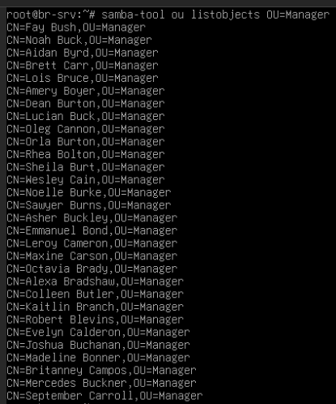

Далее пробуем авторизоваться доменным пользователем:

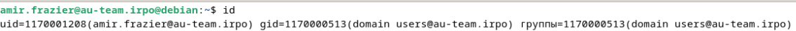
### Задание 2

Выполните настройку центра сертификации на базе HQ-SRV:

- Необходимо использовать отечественные алгоритмы шифрования
- Сертификаты выдаются на 30дней
- Выдайте сертификаты веб серверам
- Перенастройте ранее настроенный реверсивный прокси nginx на протокол https
- При обращении к веб серверам https://web.au-team.irpo и https://docker.au-team.irpo у браузера клиента не должно возникать предупреждений.
##### Решение 

Чтобы работать с ГОСТ алгоритмами в openssl для настроим их поддержку. Скачиваем необходимые пакеты:

```sh
apt update && apt install -y libengines-gost-openssl
```

Теперь внесем изменения в файл `/etc/ssl/openssl.cnf`. 

```
openssl_conf = openssl_init

[openssl_init]
engines = engine_section

[engine_section]
gost = gost_section

[gost_section]
engine_id = gost
dynamic_path = /usr/lib/x86_64-linux-gnu/engines-3/gost.so
default_algorithms = ALL
```

Проверим поддержку алгоритмов ГОСТ командой:

```shell
openssl ciphers | tr ':' '\n' | grep GOST
```

Вывод команды:

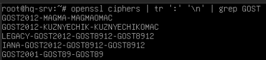

Создадим закрытый ключ с алгоритмом ГОСТ-2012:

```shell
openssl genpkey -algorithm gost2012_256 -pkeyopt paramset:TCB -out ca.key
```

Где:

- `genpkey` - определяет создание закрытого ключа
- `-algorithm gost2012_256` - выбранный алгоритм шифрования
- `-pkeyopt paramset:TCB` - устанавливает параметры OID для алгоритма шифрования при генерации ключевой пары или запроса на сертификат с помощью OpenSSL
- `-out ca.key` - файл, куда запишется закрытый ключ

Создаем сертификат сроком на 30 дней:

```shell
openssl req -new -x509 -md_gost12_256 -days 30 -key ca.key -subj "/C=RU/O=au-team.irpo/CN=hq-srv.au-team.irpo" -out ca.cer
```

Проверит сертификат можно командой:

```shell
openssl x509 -noout -text -in ca.cer
```

Создаем закрытый ключ для `web.au-team.irpo`:

```shell
openssl genpkey -algorithm gost2012_256 -pkeyopt paramset:A -out web.au-team.irpo.key
```

Создаем закрытый ключ для `docker.au-team.irpo`:

```shell
openssl genpkey -algorithm gost2012_256 -pkeyopt paramset:A -out docker.au-team.irpo.key
```

Создаем запрос на подпись для `web.au-team.irpo`:

```shell
openssl req -new -md_gost12_256 -key web.au-team.irpo.key -subj "/C=RU/O=au-team.irpo/CN=web.au-team.irpo" -out web.au-team.irpo.csr
```

Создаем запрос на подпись для `docker.au-team.irpo`:

```shell
openssl req -new  -md_gost12_256 -key docker.au-team.irpo.key -subj "/C=RU/O=au-team.irpo/CN=docker.au-team.irpo" -out docker.au-team.irpo.csr
```

Подписываем ранее созданный запрос для `web.au-team.irpo`:

```shell
openssl x509 -req -in web.au-team.irpo.csr -CA ca.cer -CAkey ca.key -CAcreateserial -out web.au-team.irpo.cer -days 30
```

Подписываем ранее созданный запрос для `docker.au-team.irpo`:

```shell
openssl x509 -req -in docker.au-team.irpo.csr -CA ca.cer -CAkey ca.key -CAcreateserial -out docker.au-team.irpo.cer -days 30
```

Создаем директорию для хранения сертификатов на ISP:

```sh
mkdir /etc/nginx/ssl
```

Переносим закрытый ключ и сертификат на ISP:

```shell
scp web.au-team.irpo.key root@172.16.1.1:/etc/nginx/ssl

scp web.au-team.irpo.cer root@172.16.1.1:/etc/nginx/ssl

scp docker.au-team.irpo.key root@172.16.1.1:/etc/nginx/ssl

scp docker.au-team.irpo.cer root@172.16.1.1:/etc/nginx/ssl
```

Также на ISP добавляем поддержку ГОСТ алгоритмов:

```sh
apt update && apt install -y libengines-gost-openssl
```

Теперь внесем изменения в файл `/etc/ssl/openssl.cnf`. 

```
openssl_conf = openssl_init

[openssl_init]
engines = engine_section

[engine_section]
gost = gost_section

[gost_section]
engine_id = gost
dynamic_path = /usr/lib/x86_64-linux-gnu/engines-3/gost.so
default_algorithms = ALL
```

Изменяем конфигурацию nginx:

- Для `web.au-team.irpo`:

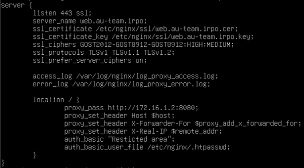

- Для `docker.au-team.irpo`:

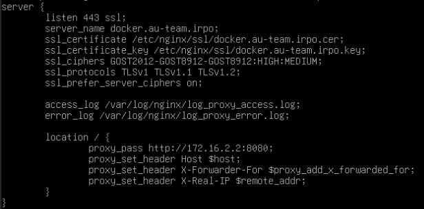

Чтобы работать с созданными сертификатами установим криптопровадер **КриптоПро CSP**. Для этого переходим на сайт https://cryptopro.ru/products/csp и скачиваем пробную версию. В результате будет скачен архив, который мы должны распаковать:

```sh
tar -xzf linux-amd64_deb.tgz
```

Запускаем скрипт установки:

```sh
./linux-amd64_deb/install_gui.sh
```

Добавляем установку пакета `Импортировать корневые сертификаты из ОС`:

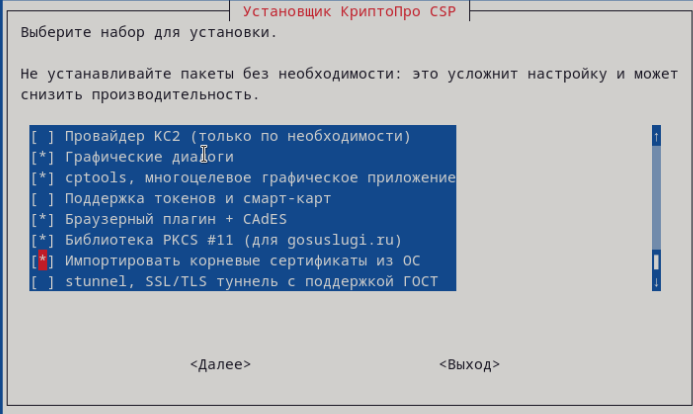

С центра сертификации мы должны импортировать сертификат на HQ-CLI:

```sh
scp ca.cer root@192.168.0.34:/root
```

Запускаем программу `Инструменты КриптоПро` и добавляем наш сертификат в доверенные корневые центры сертификации:

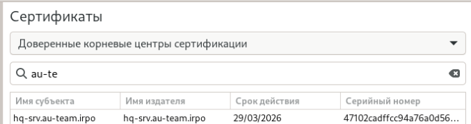
### Задание 3

Перенастройте ip-туннель с базового до уровня туннеля, обеспечивающего шифрование трафика:

- Настройте защищенный туннель между HQ-RTR и BR-RTR 
- Внесите необходимые изменения в конфигурацию динамической маршрутизации, протокол динамической маршрутизации должен возобновить работу после перенастройки туннеля
- Выбранное программное обеспечение, обоснование его выбора и его основные параметры, изменения в конфигурации динамической маршрутизации отметьте в отчёте.
##### Решение

На маршрутизаторах HQ-RTR и BR-RTR скачиваем пакет `strongswan`:

```sh
apt install strongswan -y
```

Приводим файл `/etc/ipsec.conf` на HQ-RTR к следующему виду:

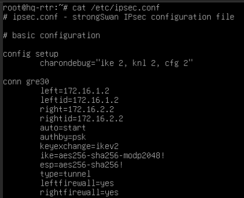

Приводим файл `/etc/ipsec.conf` на BR-RTR к следующему виду:

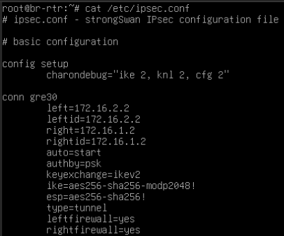

В файле `/etc/ipsec.secrets` указываем пароль для аутентификации, чтобы создать шифрованное соединение:

- На `HQ-RTR`:

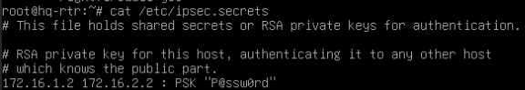

- На `BR-RTR`:

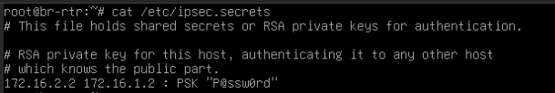

После этого перезагружаем службу `strongswan-starter`:

```sh
systemctl restrt strongswan-starter
```

Проверяем создание шифрование GRE-туннеля командой `ipsec status`, должно быть установлено соединение:

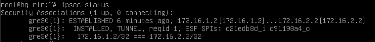
### Задание 4

Настройте межсетевой экран на маршрутизаторах HQ-RTR и BR-RTR на сеть в сторону ISP:

- Обеспечьте работу протоколов http, https, dns, ntp, icmp или дополнительных нужных протоколов 
- Запретите остальные подключения из сети Интернет во внутреннюю сеть.
##### Решение

Не решено.
### Задание 5

Настройте принт-сервер cups на сервере HQ-SRV: 

- Опубликуйте виртуальный pdf-принтер 
- На клиенте HQ-CLI подключите виртуальный принтер как принтер по умолчанию.
##### Решение 

На сервере `HQ-SRV` устанавливаем следующие пакеты:

```sh
apt update && apt install -y cups printer-driver-cups-pdf
```

Где:

- cups - установка сервера CUPS;
- printer-driver-cups-pdf - драйвер виртуального PDF-принтера.

Теперь изменяем конфигурационный файл `/etc/cups/cupsd.conf`:

- Настраиваем, чтобы cups слушал не локальный порт, а все порты:

```
listen *:631
```

- Изменяем секции `<Location />` и `<Location /admin>`:

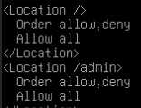

Назначаем администратора сервера CUPS:

```sh
usermod -aG lpadmin sshuser
```

Перезагружаем CUPS:

```sh
systemctl restart cups
```

Включаем общий доступ к принтеру и разрешаем печать из любой сети:

```sh
cupsctl --share-printers --remote-any
```

Добавляем PDF-принтер в CUPS:

```sh
lpadmin -p PDF-PRINTER-HQ-SRV -v cups-pdf -E -i /usr/share/ppd/cups-pdf/CUPS-PDF_opt.ppd
```

Посмотреть все добавленные принтеры можно командой `lpstat -p`:

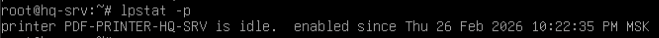

Добавляем PDF-принтер на клиенте:


Чтобы проверить работу делаем пробную печать:


В случае, если все настроено правильно должно появиться задание на печать в директории `/var/spool/cups`:


### Задание 6

Реализуйте логирование при помощи rsyslog на устройствах HQ-RTR, BR-RTR, BR-SRV: 

- Сервер сбора логов расположен на HQ-SRV, убедитесь, что сервер не является клиентом самому себе 
- Приоритет сообщений должен быть не ниже warning 
- Все журналы должны находиться в директории /opt. Для каждого устройства должна выделяться своя поддиректория, которая совпадает с именем машины 
- Реализуйте ротацию собранных логов на сервере HQ-SRV: 
	- Ротируются все логи, находящиеся в директории и поддиректориях /opt 
	- Ротация производится один раз в неделю 
	- Логи необходимо сжимать 
	- Минимальный размер логов для ротации – 10МБ.
##### Решение

На сервер HQ-SRV устанавливаем пакет rsyslog:

```sh
apt update && apt install -y rsyslog 
```

Настраиваем конфигурацию в файле `/etc/rsyslog.conf`:


Где:

- Слушаем порт tcp/514
- Логи будут храниться в директории `/opt/%HOSTNAME%/rsyslog.log`
- Создаем условия, что логи не будут собираться с машины с адресом 127.0.0.1 и 192.168.0.2, но будет происходить сбор логов с уровнем меньше 4

После этого перезагружаем rsyslog:

```sh
systemctl restart rsyslog
```

Установим rsyslog на клиентов HQ-RTR, BR-RTR, BR-SRV:

```sh
apt update && apt install -y rsyslog
```

В файле `/etc/rsyslog.d/hq-srv.conf` прописываем следующие:

```
*.* @@192.168.0.2:514
```

После этого перезагружаем rsyslog и проверяем работу командой `logger`:

```sh
systemctl restart rsyslog

logger -p user.warning "Test warning"
```

В итоге на HQ-SRV должна быть создана директория:


Теперь настроим ротацию логов. В файле `/etc/logrotare.d/hq-srv`:


Где:

- weekly - еженедельная ротация
- size 10M - при достижении 10 Мб происходит ротация
- compress - включение сжатия
- missiongok - если файла не существует, не выкидывать ошибку
- notifempty - если файл пустой, не выполнять никаких действий
- create 0640 root root - создание нового лог-файла с правами после ротирования
- rotate 4 - хранить 4 копии ротированных файлов

Проверяем ротацию:

```sh
logrotate -d /etc/logrotare.d/hq-srv
```

После настраиваем crontab, чтобы ротация запускалась автоматически:

```sh
crontab -e
```

После ввода вышеуказанной команды откроется текстовый редактор, куда вписываем следующие:


### Задание 7

На сервере HQ-SRV реализуйте мониторинг устройств с помощью открытого программного обеспечения 

- Обеспечьте доступность по URL - http://mon.au-team.irpo для сетей офиса HQ, внесите изменения в инфраструктуру разрешения доменных имён;
- Мониторить нужно устройства HQ-SRV и BR-SRV;
- В мониторинге должны визуально отображаться нагрузка на ЦП, объем занятой ОП и основного накопителя;
- Логин и пароль для службы мониторинга admin P@ssw0rd;
- Организуйте доступ к мониторингу для HQ-CLI, без внешнего доступа;
- Выбор программного обеспечения, основание выбора и основные параметры с указанием порта, на котором работает мониторинг, отметьте в отчёте.
##### Решение 

Мониторинг будет производиться на базе Prometheus + Grafana + Node Exporter, которые будут развернуты в Docker.

Поэтому на устройства BR-SRV (можно не устанавливать, так как установка производилась в задание 6 модуля 2) и HQ-SRV установим docker:

```sh
 curl -fsSL https://get.docker.com -o get-docker.sh
 
 sh get-docker.sh
 
 apt update && apt install -y docker-ce
```

На сервере HQ-SRV произведем развертывание Prometheus и Grafana в docker-compose:

Установка Prometheus (место куда будут отправляться метрики) и Grafana на `HQ-SRV`:

- Для начала создадим директорию для docker-compose:

```sh
mkdir /root/docker/monitoring
```

- Содержание `docker-compose.yml`:

```yaml
services:
    prometheus:
        image: prom/prometheus
        restart: unless-stopped
        ports:
            - 9090:9090
        volumes:
            - ./config/prometheus.yml:/etc/prometheus/prometheus.yml
        networks:
            - monitoring
    grafana:
	    image: grafana/grafana
	    user: "0"
        ports:
            - 3000:3000
        volumes:
            - ./grafana_data:/var/lib/grafana
        restart: unless-stopped
        networks:
		    - monitoring
		      
networks:
    monitoring:
        driver: bridge
```

- В файле `prometheus.yml` укажем настройки Prometheus:

```yaml
global:
  scrape_interval: 5s
  
scrape_configs:
  - job_name: "node-exporter"
    static_configs:
    - targets:
      - 192.168.0.2:9100
      - 192.168.1.2:9100
```

- Запускаем:

```sh
docker compose up -d
```

Установка Node-Exporter (ПО, которая отвечает за сбор метрик с хоста) производится установка на `HQ-SRV` и `BR-SRV`:

- Для начала создадим директорию для docker-compose:

```sh
mkdir /root/docker/node-exporter
```

- Содержание `docker-compose.yml`:

```yaml
services:
  node-exporter:
     image: prom/node-exporter
     volumes:
       - /proc:/host/proc:ro
       - /sys:/host/sys:ro
       - /:/rootfs:ro
     container_name: exporter
     command:
       - --path.procfs=/host/proc
       - --path.sysfs=/host/sys
       - --collector.filesystem.ignored-mount-points
       - ^/(sys|proc|dev|host|etc|rootfs/var/lib/docker/containers|rootfs/var/lib/docker/overlay2|rootfs/run/docker/netns|rootfs/var/lib/docker/aufs)($$|/)
     ports:
       - 9100:9100
     restart: unless-stopped
     environment:
       - TZ="Europe/Moscow"
```

- Запускаем Node-Exporter:

```sh
docker compose up -d
```

Переходим в web-интерфейс Grafana по адресу `http://192.168.0.2:3000`, где встречает окно входа логин - `admin`, пароль `admin`. После первого будет требование изменить пароль и меняем его на `P@ssw0rd`.


Добавить соединение к Prometheus можно в разделе `Connections/Data sources`, где указываем адрес сервера:


Далее импортируем Dashboard под номером 1860:


Чтобы мы могли обращаться по доменному имени добавим запись на контроллере домена BR-SRV:

```sh
samba-tool dns add 127.0.0.1 au-team.irpo mon A 192.168.0.2 -U administrator
```
### Задание 8

Реализуйте механизм инвентаризации машин HQ-SRV и HQ-CLI через Ansible на BR-SRV: 

- Плейбук должен собирать информацию о рабочих местах: 
- Имя компьютера 
- IP-адрес компьютера 
- Плейбук, должен быть размещен в директории /etc/ansible, отчёты в поддиректории PC-INFO, в формате .yml. Файлы должны называется именем компьютера, который был инвентаризирован 
- Файл плейбука располагается в образе Additional.iso в директории playbook
##### Решение 

Создаем директорию, где будет храниться playbook:

```sh
mkdir /etc/ansible/PC_INFO/
```

В ней создаем playbook файл `/etc/ansible/PC_INFO/playbook.yml`:

```yaml
---
- name: PC-INFO
  hosts: HQ-Servers
  
  tasks:
  - name: Append hostname in report file
    lineinfile:
	    path: /etc/ansible/PC_INFO/{{ ansible_hostname }}.yml
	    line: "Hostname: {{ ansible_hostname }}"
	    create: true
	delegate_to: 127.0.0.1
	
  - name: Append IPv4 address
    lineinfile:
	    path: /etc/ansible/PC_INFO/{{ ansible_hostname }}.yml
	    line: "IPv4 address: {{ ansible_default_ipv4.address }} \n"
	    create: true
	delegate_to: 127.0.0.1
```

Запускаем playbook файл:

```sh
ansible-playbook /etc/ansible/PC_INFO/playbook.yml
```
### Задание 9

На HQ-SRV настройте программное обеспечение fail2ban для защиты ssh 

- Укажите порт ssh 
- При 3 неуспешных авторизациях адрес атакующего попадает в бан 
- Бан производится на 1минуту
##### Решение

Скачиваем fail2ban и включаем его: на машине HQ-SRV

```sh
apt update && apt install -y fail2ban
```

Создаем файл с конфигурацией по пути `/etc/fail2ban/jail.d/ssh.conf`:

```
[ssh]
enabled = true
filter = sshd
action = iptables[name=SSH, port=2026, protocol=tcp]
logpath = /var/log/auth.log
findtime = 600
maxretry = 3
bantime = 60
```

Перезагружаем fail2ban:

```sh
systemctl restart fail2ban
```
### Задание 10

Настройка резервного копирования директории сервера HQ-SRV: 

- На HQ-SRV развернуть программное обеспечение для резервного копирования и восстановления данных с защитой от вирусов шифровальщиков 
- В качестве решения рекомендуется использовать программное обеспечение Кибер Бэкап версии 17.4 или аналог 
- Настройте организацию irpo 
- Настройте пользователя с правами администратора на сервере HQ-SRV, имя пользователя irpoadmin с паролем P@ssw0rd 
- Установите на HQ-CLI агент с функциями узла хранилища и подключите его к серверу управления
- На узле хранилища HQ-CLI создайте директорию /backup и выберите её в качестве устройства хранения 
- Создайте два плана резервного копирования для сервера HQ-SRV 
	- план для резервного копирования директории /etc и всех её поддиректорий 
	- план для резервного копирования базы данных webdb типа mysql 
- Выполните резервное копирование директории /etc и всех её поддиректорий сервера HQ-SRV на узел хранения HQ-CLI 
- Выполните резервное копирование базы данных webdb сервера HQ-SRV на узел хранения HQ-CLI
##### Решение

Не решено.